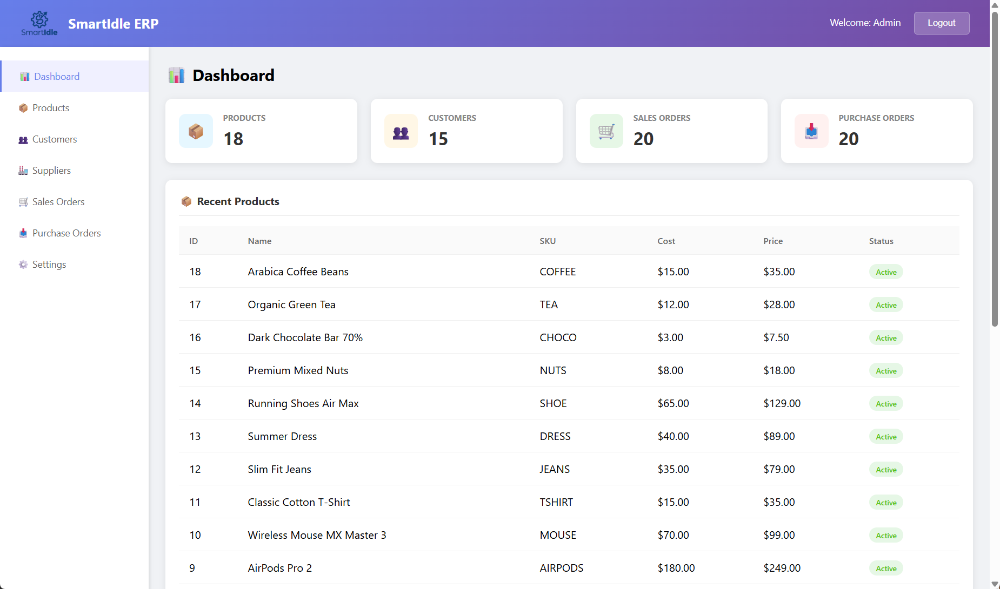
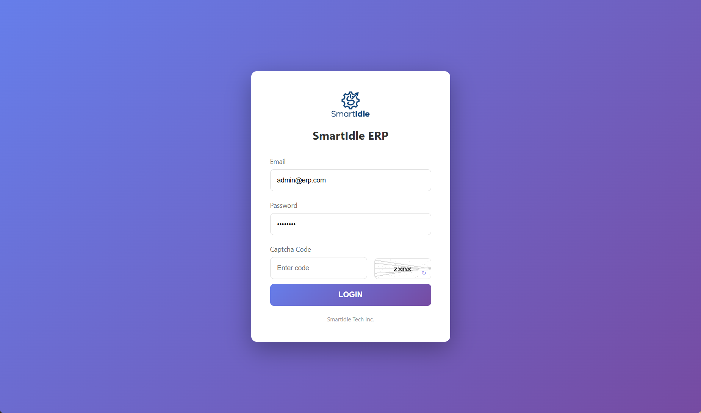
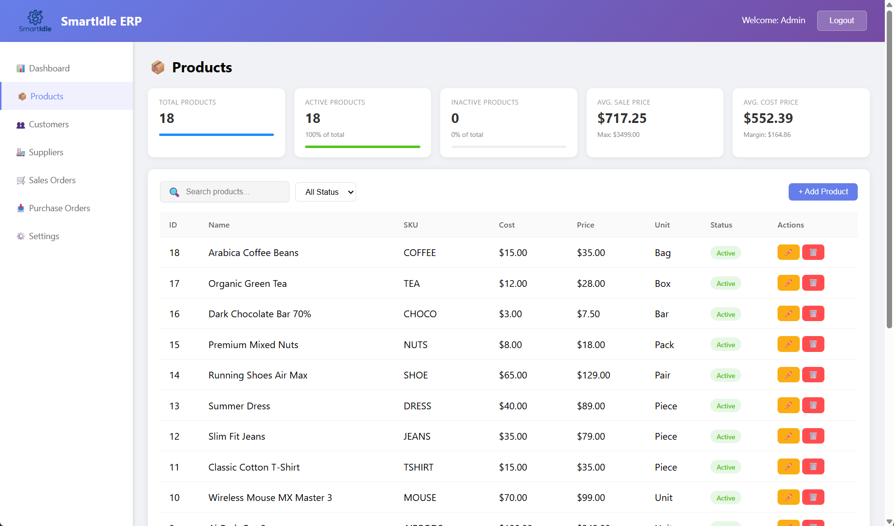
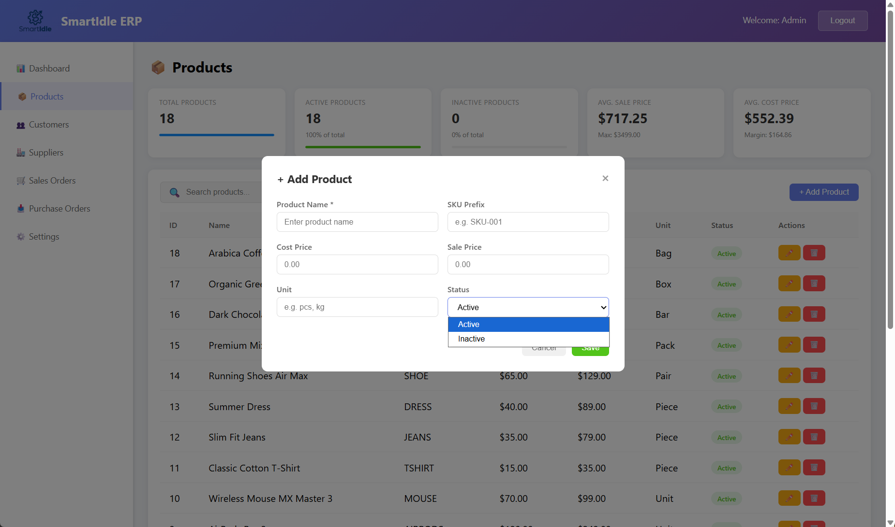
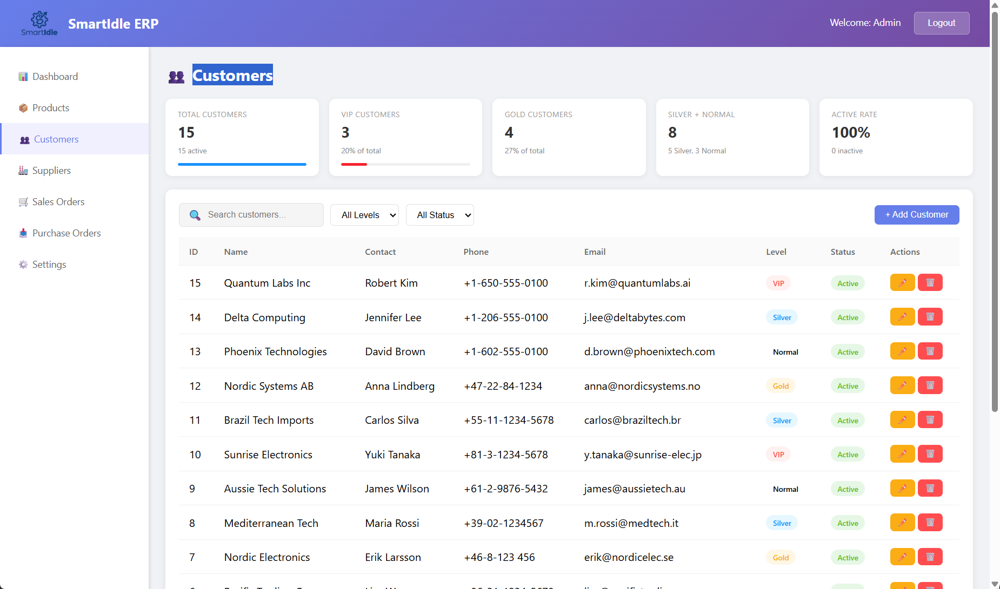
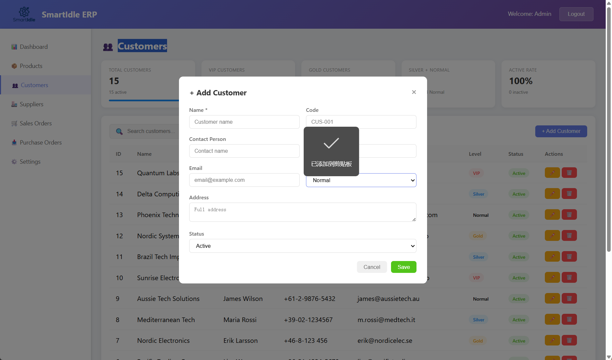
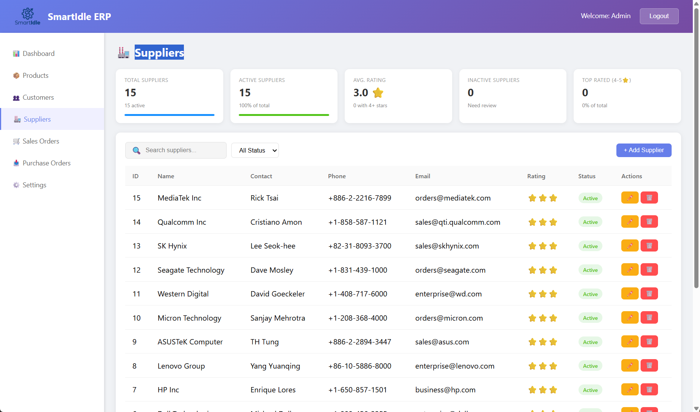
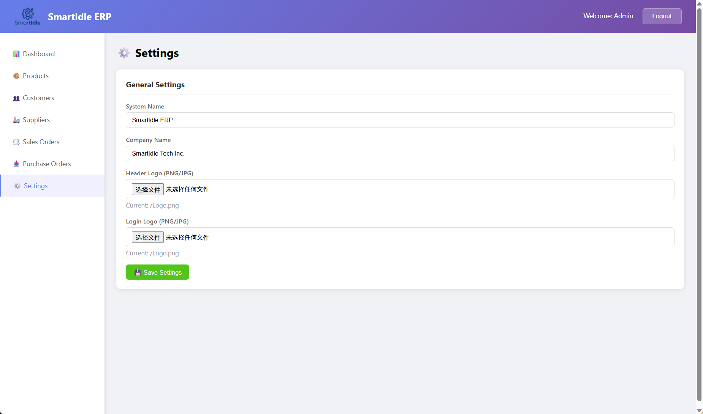

# SmartIdle ERP System

A comprehensive e-commerce ERP (Enterprise Resource Planning) system built with ThinkPHP 8.x, designed to streamline business operations including sales, purchases, inventory management, and financial workflows.



## Features

### 🔐 Authentication
- Secure login system with session management
- Role-based access control (RBAC)
- Permission-based route protection

### 📊 Dashboard
- Real-time business metrics overview
- Sales and purchase order statistics
- Inventory alerts and notifications

### 📦 Product Management
- Multi-level product categories
- SKU (Stock Keeping Unit) management
- Product specifications and variants
- Customer-specific pricing

### 👥 Customer Management
- Customer profile management
- Multiple shipping addresses per customer
- Customer-specific discounts and pricing tiers

### 🏢 Supplier Management
- Supplier directory with contact information
- Supplier-product relationships
- Purchase order integration

### 📋 Sales Orders
- Full sales order lifecycle management
- Quote → Order → Delivery → Return workflow
- Order status tracking
- Automatic inventory deduction

### 🛒 Purchase Orders
- Purchase requisition to order workflow
- Supplier selection and comparison
- Receiving and inspection management

### 📥 Inventory Management
- Multi-warehouse support
- Real-time stock tracking
- Inventory movement logs
- Low stock alerts

### 💰 Financial Management
- Payment tracking (receivables/payables)
- Receipt generation
- Financial reconciliation

### 🎁 Promotions & Coupons
- Flexible promotion rules
- Coupon generation and validation
- Time-limited offers

### ⚙️ System Settings
- Company configuration
- Role and permission management
- Department structure
- System parameter customization

## Screenshots

### Login Page


### Dashboard


### Products Management



### Customers Management



### Sales Orders


### Purchase Orders


### Suppliers


### Settings


## Technology Stack

| Component | Technology |
|-----------|------------|
| Backend Framework | ThinkPHP 8.x |
| Database | SQLite 3 (WAL Mode) |
| Testing Framework | PHPUnit 10.x |
| PHP Version | >= 8.1 |
| Authentication | Session + Middleware |

## Project Structure

```
SmartIdleERP/
├── app/
│   ├── admin/              # Admin panel application
│   │   ├── controller/     # Controllers
│   │   ├── model/          # Models
│   │   ├── service/        # Business logic services
│   │   └── middleware/     # Custom middleware
│   ├── api/                # RESTful API application
│   │   ├── controller/    # API controllers
│   │   └── route.php       # API routes
│   ├── model/             # Core domain models
│   ├── common/            # Common utilities
│   │   ├── exception/     # Exception handlers
│   │   └── functions.php  # Helper functions
│   └── Services/           # Shared business services
├── config/                 # Configuration files
├── database/
│   ├── migrations/        # Database migrations
│   ├── seeders/           # Data seeders
│   └── database.sqlite    # SQLite database file
├── public/                # Web entry point & static assets
├── routes/                # Route definitions
├── storage/               # Runtime storage
├── tests/
│   ├── Unit/              # Unit tests
│   └── Feature/           # Feature/Integration tests
├── docs/                  # Documentation & screenshots
├── composer.json          # Dependencies
└── README.md              # This file
```

## Installation

### Prerequisites

- PHP 8.1 or higher
- Composer (PHP package manager)
- SQLite3 extension

### Step 1: Install Dependencies

```bash
cd Source-Code
composer install
```

### Step 2: Run Database Migrations

```bash
php think migrate:run
```

### Step 3: Seed Initial Data

```bash
php think seed:run
```

### Step 4: Start Development Server

```bash
php think run
```

Visit http://localhost:8000

## Default Credentials

| Role | Email | Password |
|------|-------|----------|
| Administrator | admin@erp.com | admin123 |

## API Documentation

### Admin APIs

#### Authentication
- `POST /admin/login/check` - User login
- `GET /admin/login/logout` - User logout

#### Dashboard
- `GET /admin/index/dashboard` - Dashboard data

#### Products
- `GET /admin/product/list` - Product list
- `GET /admin/product/detail` - Product detail
- `POST /admin/product/save` - Create/Update product

#### Customers
- `GET /admin/customer/list` - Customer list
- `POST /admin/customer/save` - Create/Update customer

#### Sales Orders
- `GET /admin/salesOrder/list` - Sales order list
- `POST /admin/salesOrder/save` - Create sales order
- `POST /admin/salesOrder/confirm` - Confirm order
- `POST /admin/salesOrder/deliver` - Create delivery

#### Inventory
- `GET /admin/inventory/list` - Inventory list
- `GET /admin/inventory/check` - Stock check

#### Purchase Orders
- `GET /admin/purchase/list` - Purchase order list
- `POST /admin/purchase/save` - Create purchase order

### Public APIs

- `GET /api/product/list` - Product catalog
- `GET /api/product/detail` - Product detail
- `GET /api/product/categories` - Category list

## Testing

Run the full test suite:

```bash
./vendor/bin/phpunit
```

Run specific test suites:

```bash
# Unit tests only
./vendor/bin/phpunit --testsuite Unit

# Feature tests only
./vendor/bin/phpunit --testsuite Feature
```

Run with coverage report:

```bash
./vendor/bin/phpunit --coverage-html coverage
```

## Core Modules

### P0 - Core Modules
- [x] Employee & Permission System
- [x] Product & SKU Management
- [x] Customer & Supplier Management
- [x] Warehouse & Inventory
- [x] Sales Orders
- [x] Purchase Orders
- [x] Sales Delivery & Returns
- [x] Financial Management

### P1 - E-commerce Modules
- [x] Promotions & Coupons
- [x] Purchase Inquiries
- [x] Approval Workflows

### P2 - Enhanced Modules
- [ ] Production Management (BOM/Work Orders)
- [ ] Advanced System Configuration

## Database Schema

The system includes 73 core database tables covering the full e-commerce ERP business workflow:

- **System Tables**: employees, departments, roles, permissions
- **Product Tables**: products, product_categories, product_skus, product_specs
- **Customer Tables**: customers, customer_addresses, customer_prices, customer_coupons
- **Supplier Tables**: suppliers, supplier_products
- **Warehouse Tables**: warehouses, locations
- **Inventory Tables**: inventory, inventory_logs
- **Sales Tables**: sales_quotes, sales_orders, sales_deliveries, sales_returns
- **Purchase Tables**: purchase_inquiries, purchase_orders, purchase_receives
- **Finance Tables**: finance_payments, finance_receipts
- **Production Tables**: boms, work_orders, work_order_materials
- **Workflow Tables**: approval_flows, approval_instances, approval_records

## Configuration

### Database Configuration

Edit `config/database.php`:

```php
return [
    'default' => 'sqlite',
    'connections' => [
        'sqlite' => [
            'database' => database_path('database.sqlite'),
        ],
    ],
];
```

### Application Configuration

Edit `.env`:

```env
APP_DEBUG = true
APP_TRACE = false
```

## Contributing

1. Fork the repository
2. Create a feature branch (`git checkout -b feature/amazing-feature`)
3. Commit your changes (`git commit -m 'Add amazing feature'`)
4. Push to the branch (`git push origin feature/amazing-feature`)
5. Open a Pull Request

## License

This project is licensed under the Apache-2.0 License - see the [LICENSE](LICENSE) file for details.

## Support

For support, issues, or feature requests, please create an issue on the GitHub repository.

---

**SmartIdle ERP** - Empowering businesses with intelligent automation.
